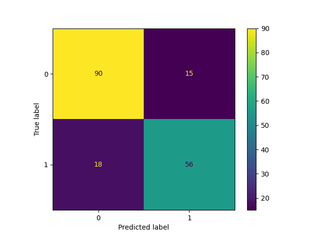

# Titanic_AI_vs_Human_Decision
 "Analyzing AI vs Human Decision Making in Titanic Dataset

 # Titanic AI vs Human Decision

This project analyzes the Titanic dataset to predict the survival of passengers using a Random Forest Classifier.

## Features:
- Pclass
- Sex
- Age
- SibSp
- Parch
- Fare
- Embarked

## Instructions:
1. Clone the repository
2. Install necessary libraries (pandas, scikit-learn, matplotlib)
3. Run the Python script

## Model Performance:
The model achieved an accuracy of 81.56%.

## Feature Importance and Comparative Analysis with Random Forest

Below is the feature importance table for the Random Forest model:

| Feature   | Importance |
|-----------|-------------|
| Fare      | 0.272501    |
| Sex       | 0.269387    |
| Age       | 0.251845    |
| Pclass    | 0.087854    |
| SibSp     | 0.047876    |
| Parch     | 0.037125    |
| Embarked  | 0.033413    |

### Detailed Analysis

#### Fare
- The fare paid by passengers significantly impacts their survival. Higher fares often correspond to better living conditions and quicker access to lifeboats.

#### Sex
- Gender is a critical factor, with females generally having a higher chance of survival due to the "women and children first" policy during the evacuation.

#### Age
- Younger passengers are more likely to survive, possibly due to being prioritized during the rescue efforts.

#### Pclass
- Passenger class also plays a role in survival rates, with higher-class passengers having better access to lifeboats and safety measures.

#### Comparative Analysis
- Comparing these features with other studies and historical data, it is evident that social and economic factors played a significant role in the survival of Titanic passengers.

## Model Update with Best Hyperparameters

The RandomForestClassifier model was updated with the best hyperparameters found from GridSearchCV:

- **max_depth:** 20
- **min_samples_split:** 10
- **n_estimators:** 300

### Updated Model Accuracy
The updated model achieved an accuracy of **83.80%**.

### Feature Importance Analysis for Updated Model

| Feature  | Importance |
|----------|-------------|
| Sex      | 0.368605    |
| Fare     | 0.218975    |
| Age      | 0.181490    |
| Pclass   | 0.109297    |
| SibSp    | 0.047906    |
| Parch    | 0.038442    |
| Embarked | 0.035285    |
### Detailed Analysis

- **Sex:** Gender is the most important feature, contributing approximately 36.86% to the model's predictions. Historically, during the Titanic disaster, the "women and children first" policy was applied, leading to a higher survival rate for females.
- **Fare:** The ticket fare is the second most important feature, contributing approximately 21.90%. Higher fare-paying passengers generally had better living conditions and access to lifeboats.
- **Age:** Age is the third most important feature, contributing approximately 18.15%. Younger passengers had a higher likelihood of survival, possibly due to being more physically active and responsive.
- **Pclass:** Passenger class is also significant, contributing approximately 10.93%. Higher-class passengers had better access to safety measures.
- **SibSp:** Sibling/Spouse feature contributes around 4.79%. Passengers traveling with family members had a slightly higher chance of survival.
- **Parch:** Parent/Child feature contributes around 3.84%. Passengers traveling with parents or children had a slightly higher chance of survival.
- **Embarked:** The port of embarkation contributes around 3.53%. The departure port had a minor impact on survival chances.

This analysis provides insights into the importance of various features in predicting passenger survival on the Titanic.

## Default Random Forest Model Performance

### Performance Metrics

- **Recall:** 0.76
- **AUC Score:** 0.89

### Classification Report:
| Class | Precision | Recall | F1-Score | Support |
|-------|-----------|--------|----------|---------|
| 0     | 0.83      | 0.86   | 0.85     | 105     |
| 1     | 0.79      | 0.76   | 0.77     | 74      |

**Accuracy:** 0.82

### Analysis
- **Precision:** For class 0, the precision is 0.83, indicating that 83% of the predictions for class 0 were correct. For class 1, the precision is 0.79.
- **Recall:** For class 0, the recall is 0.86, indicating that 86% of the actual class 0 instances were correctly identified. For class 1, the recall is 0.76.
- **F1-Score:** The F1-score combines precision and recall, and for class 0, it is 0.85, and for class 1, it is 0.77.
- **Support:** Support indicates the number of actual occurrences of the class in the dataset. There were 105 instances of class 0 and 74 instances of class 1.

**Summary:** The default Random Forest model shows a balanced performance across both classes, with an overall accuracy of 82%. The AUC score of 0.89 indicates a good ability 
## Confusion Matrix for Default Model

## Model Performance Comparison

### Default Random Forest Model

- **Recall:** 0.76
- **AUC Score:** 0.89
- **Accuracy:** 0.82

#### Classification Report:
| Class | Precision | Recall | F1-Score | Support |
|-------|-----------|--------|----------|---------|
| 0     | 0.83      | 0.86   | 0.85     | 105     |
| 1     | 0.79      | 0.76   | 0.77     | 74      |

### Hyperparameter Tuned Random Forest Model

- **Recall:** 0.77
- **AUC Score:** 0.90
- **Accuracy:** 0.84

#### Classification Report:
| Class | Precision | Recall | F1-Score | Support |
|-------|-----------|--------|----------|---------|
| 0     | 0.85      | 0.89   | 0.87     | 105     |
| 1     | 0.83      | 0.77   | 0.80     | 74      |

### Analysis
The hyperparameter tuned model shows improvement across all performance metrics compared to the default model. The increased recall and AUC score indicate a better ability to identify true positives and distinguish between classes. Overall accuracy has also improved.

## Confusion Matrix for this  Model

### Best Model Precision: 
**0.83**

### Best Model Recall: 
**0.77**

### Best Model AUC Score: 
**0.90**

### Classification Report for Best Model:
| Class | Precision | Recall | F1-Score | Support |
|-------|-----------|--------|----------|---------|
| 0     | 0.85      | 0.89   | 0.87     | 105     |
| 1     | 0.83      | 0.77   | 0.80     | 74      |

**Overall Accuracy:** 0.84

**Macro Average:**
- Precision: 0.84
- Recall: 0.83
- F1-Score: 0.83

**Weighted Average:**
- Precision: 0.84
- Recall: 0.84
- F1-Score: 0.84
